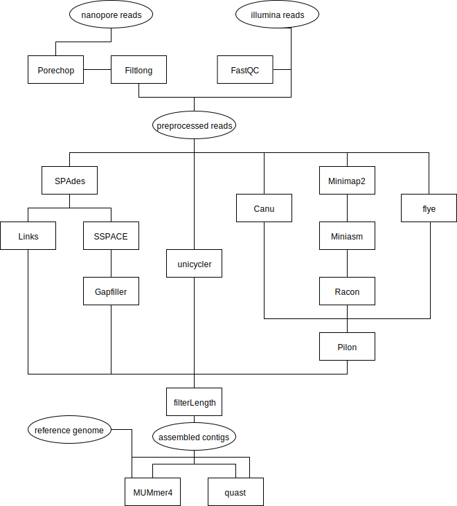

hybridAssembly
===============

hybridAssembly is a pipeline for hybrid de novo assembly of bacterial genomes. The pipeline is based around a [NextFlow](https://github.com/nextflow-io/nextflow) script. 

Aims of this pipeline:
* Give an overview about different approaches to hybrid Assembly
* Compare the results of different tools
* Learning worklfow management with Nextflow

This pipeline is mainly intended for personal use and therefore not well documented or easy to implement. If I find the time, I might create a docker container to share all tools used. 

Installation:
-------------

1) Clone this repository

2) Install Nextflow [NextFlow](https://github.com/nextflow-io/nextflow)

3) Change the path variables for the different tools in the config file  'nextflow.config'

Assembly paths:
---------------
There are seven different run configuration which select different assembly tools:

* `spades_sspace` SPAdes assembly with SSPACE scaffolding
* `spades_links` SPAdes assembly with LINKS scaffolding
* `canu` Canu assembly
* `unicycler` [Unicycler](https://github.com/rrwick/Unicycler) full bacterial assembly pipeline
* `flye` [Flye](https://github.com/fenderglass/flye) assembler
* 

